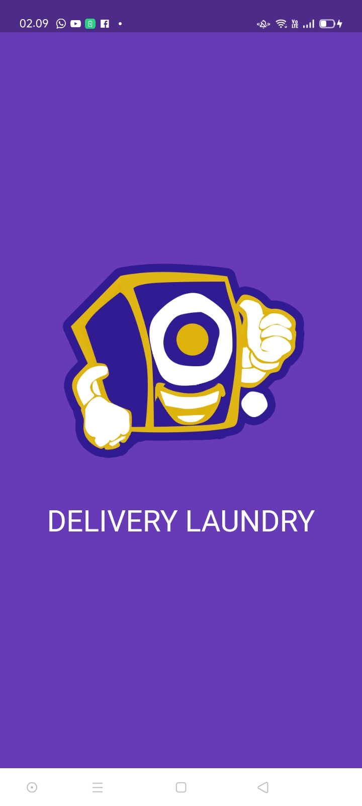
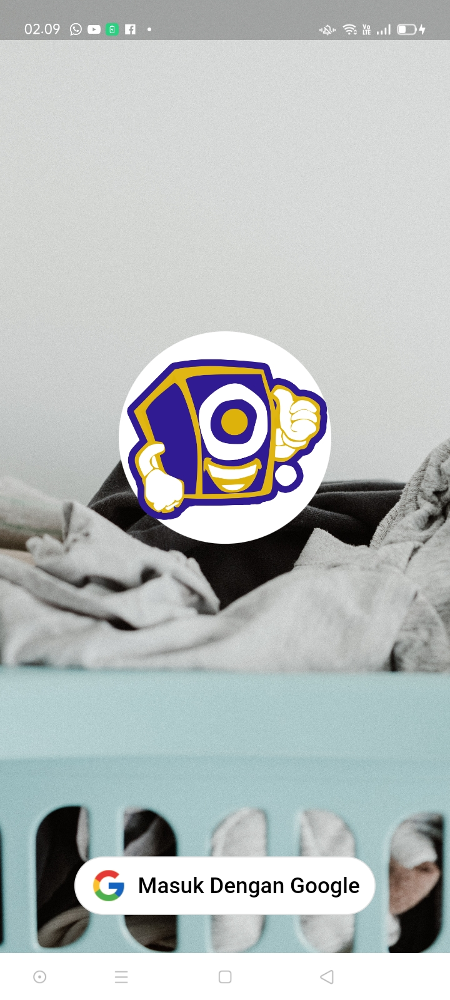
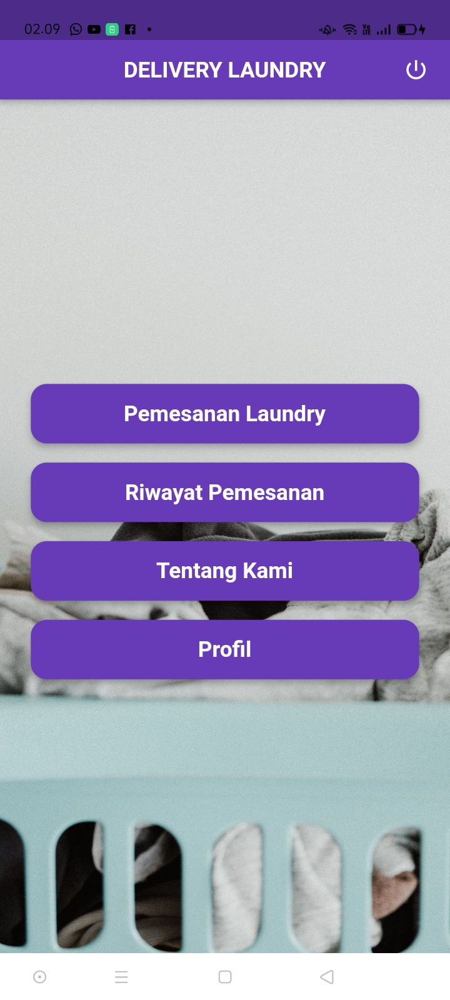
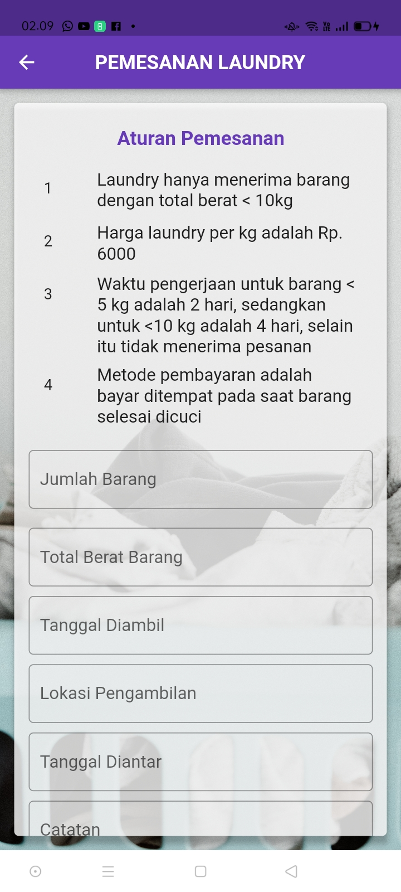
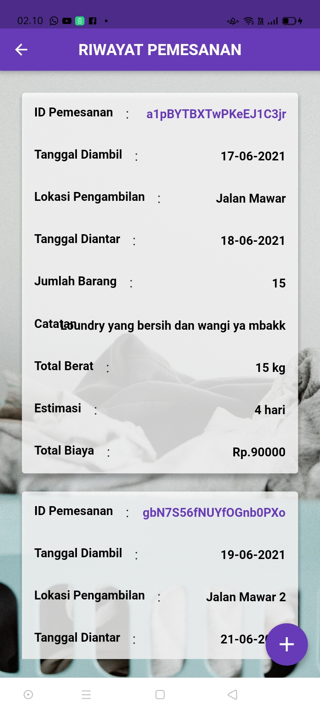
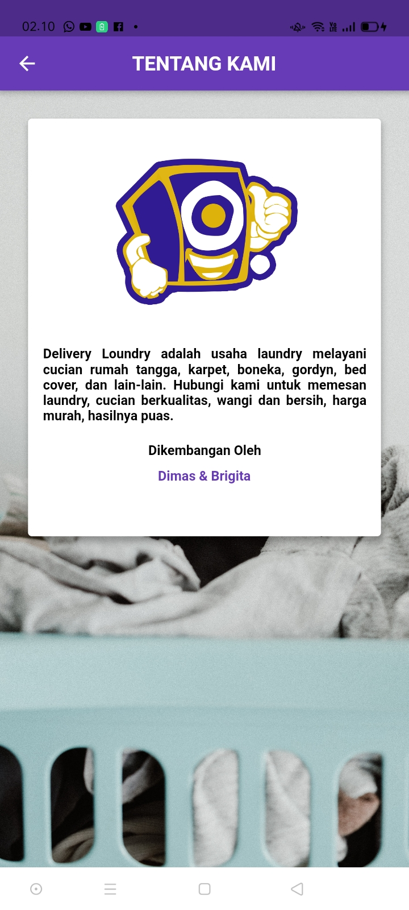
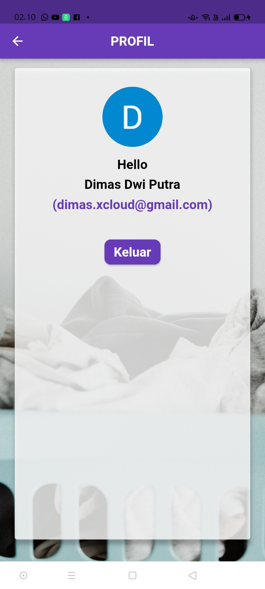

# Delivery Laundry

Aplikasi Delivery Laundry yang berbasis Android menggunakan Flutter dan Firebase Database

Delivery Loundry adalah usaha loundry melayani cucian rumah tangga, karpet, boneka, gordyn, bed cover, dan lain-lain. Hubungi kami untuk memesan laundry, cucian berkualitas, wangi dan bersih, harga murah, hasilnya puas.

## Developer
- [Dimas 263](https://github.com/Dimas263)
- [Brigita Creator](https://github.com/brigittaps-creator)

## Aplikasi

## Tampilan Aplikasi
.

## Download Aplikasi
[Download Aplikasi Delivery Laundry](https://github.com/Dimas263/deliverylaundry/blob/master/deliverylaundry.apk)

## Flutter

Aplikasi ini kami buat dengan menggunakan Flutter

- [Cara membuat aplikasi Flutter](https://flutter.dev/docs/get-started/codelab)
- [Contoh project Flutter](https://flutter.dev/docs/cookbook)
- [online documentation](https://flutter.dev/docs)
